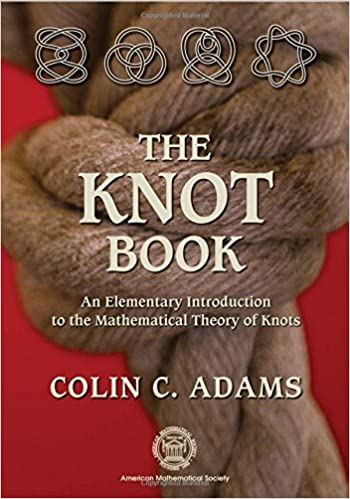

# The Knot Book

## Description:
Knots are familiar objects. We use them to moor our boats, to wrap our packages, to tie our shoes. Yet the mathematical theory of knots quickly leads to deep results in topology and geometry. "The Knot Book" is an introduction to this rich theory, starting with our familiar understanding of knots and a bit of college algebra and finishing with exciting topics of current research. "The Knot Book" is also about the excitement of doing mathematics. Colin Adams engages the reader with fascinating examples, superb figures, and thought-provoking ideas. He also presents the remarkable applications of knot theory to modern chemistry, biology, and physics. This is a compelling book that will comfortably escort you into the marvelous world of knot theory. Whether you are a mathematics student, someone working in a related field, or an amateur mathematician, you will find much of interest in "The Knot Book

## Notes:
| Section | Documents |
| ------- | --------- |

## Solutions:
| Section | Documents |
| ------- | --------- |
